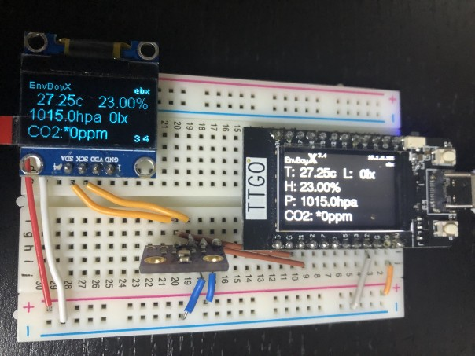
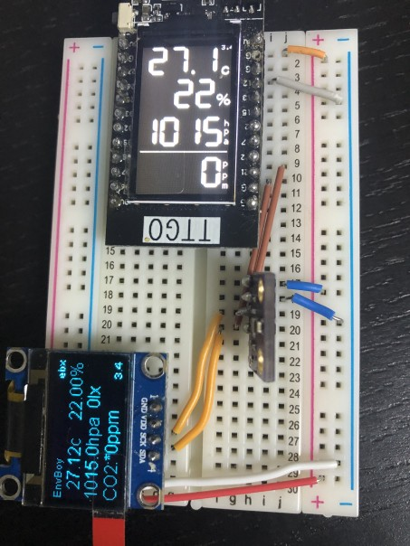

# EnvBoyX

Arduino environment monitor for ESP32 / ESP8266 based boards.

## All of documents

* [書き込み方法（日本語）](docs/how_to_write.ja.md)
* [How to write](docs/how_to_write.en.md)

View document on read the docs
https://envboyx.readthedocs.io/en/latest/

# images

## Default output image on TTGO T-Display



## Vertical Output Image on TTGO T-Display



# overview

## target boards

* ESP32 based boards
* ESP8266 based boards

## functions

* Show sensor output on display
* HTTP Json endpoint for getting sensor output 
* Highly configurable and flexible
* Supports many sensors

## sensors and devices

All are optional.

* BME280 (Temperature, Humidity, Pressure sensor)
* TSL2561 (luminous sensor)
* LPS22HB (Pressure sensor)
* AM2302 (Temperature sensor, got wrong value at first time)
* MH-Z19B (CO2 sensor UART mode)
* SSD1306 (I2C OLED 128x64px)
* ST7789 (SPI TFT 240x135px)

# specs

## pin assign

### I2C

Defined at `global.cpp`

| TYPE  | SDA | SCL  | note             |
| ----- | ----| ---- | ---------------- |
|ESP32  |  21 | 22   | not configurable |
|ESP8266|   5 |  4   | not configurable |

### MH-Z19 Serial(UART)

Defined at `mhz19_uart.cpp`

| TYPE  | Rx  | Tx   | note                                          |
| ----- | ----| ---- | --------------------------------------------- |
|ESP32  |  32 | 33   | HardwareSerial 2, configurable via web config |
|ESP8266|  14 |  0   | SoftwareSerial , fixed                        |

## how to use

### first time

* Read getting started of this document.

### change setting

* Poweroff or reset on waiting for resetting screen.
* (v42) Use Config API
 
### version up

* Same as first time
* After version up, EnvBoy may be automatically boots up in SETUP MODE if config parameter is added.

## functions

### Display

* SSD1306: Auto detect
* SH1106: Usable but need setting on setting mode, otherwise you see line on screen edge
* ST7789: Must configure in web config

### HTTP Web API

EnvBoyX has http web API.
[API Docs](docs/api.en.md) for details.

| since | METHOD | ENDPOINT      | RETURN | description                |
| ------| ------ | ------------- | -------------------------- | -------|
| 2.0   | GET | /             | JSON | sensor value as JSON.|
| 2.0   | GET | /ping         | TEXT | returns pong. |
| 39.0  | GET | /stastics     | JSON | stastics JSON |
| 3.4   | GET | /brightness   | JSON | value=0-255 set display brightness (0-255) 0 means OFF |
| 3.4   | GET | /display      | JSON | set display power (1 = ON / 0 = OFF) |
| 40.0  | POST | /goto_setup  | JSON | Go to setup mode at next boot |
| 41.0  | POST | /mhz19b/abc  | JSON | value=1 ON value=0 OFF |
| 41.0  | POST | /mhz19b/zeroCalibration | TEXT | __DANGER__ Use if you know what you are doing |
| 42.0  | GET  | /config                 | JSON | Get config |
| 42.0  | POST | /config                 | JSON | Change config |
| 42.0  | POST | /config/commit          | JSON | Save config |
| 42.0  | POST | /config/revert          | JSON | Revert to last saved config |

NOTE: There is no reboot API, because of security reason.

### HTTP Web API cURL examples

These are example of calling API

##### Simple get API

```
curl http://[envboy IP or mDNShostname.local]/
{"product":"EnvBoyX","uptime":"01:18:02","uptimeMills":4682994,"temparature":"28.60","humidity":"35.00","pressure":"976.81","luminous":"16","luminousIr":"2","co2ppm":"-999","co2ppmAccuracy":"","rssi":-12}
```

##### GET with parameter API

```
curl http://[envboy IP or mDNShostname.local]/brightness?value=100`
OK
```

##### POST without parameter API

```
$ curl -X POST http://[envboy IP or mDNShostname.local]/goto_setup
OK
```

# appendix

## Setups I am using

* T-Display with BME280, MHZ-19B
* NodeMCU V3 V2 ESP32 with SSD1306, BME280, MH-Z19B
* NodeMCU V3 ESP8266 with BME280, MH-Z19B

## Boards I tested (at least once)

### ESP32

* LilyGO TTGO T-DISPLAY (ESP32 and ST7789 TFT)
* NodeMCU V3 V2 ESP32

### ESP8266

* D-Duino (ESP8266 and ST1306 OLED board)
* WeMos D1mini
* NodeMCU V3

## Version History

see [Version History](docs/history.md) for details.
